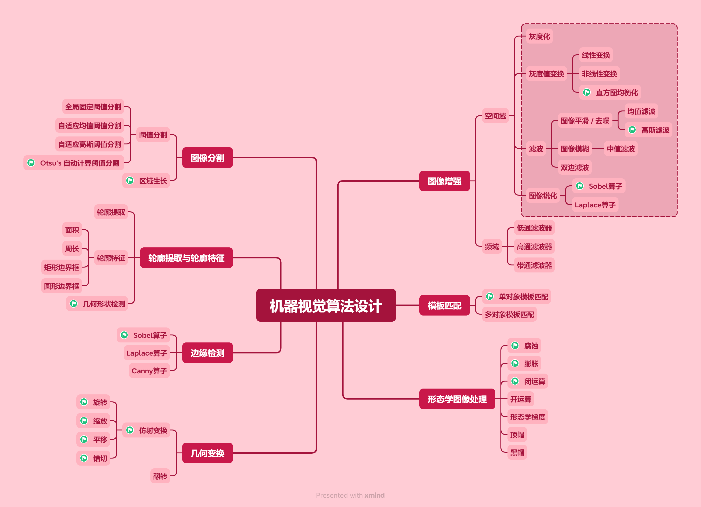
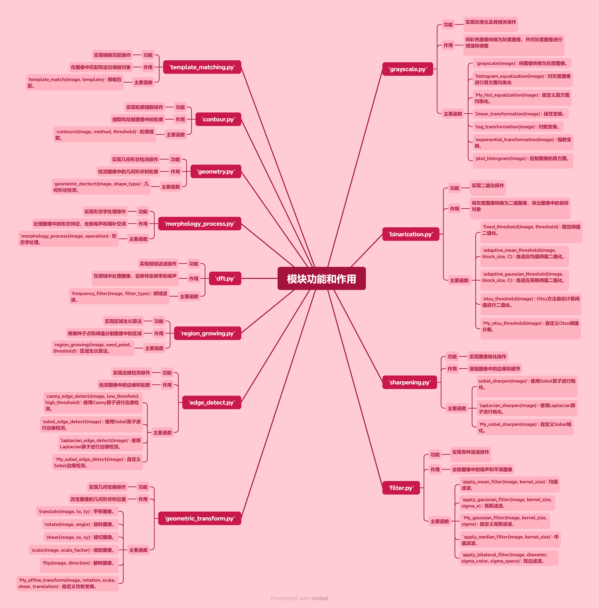

# 机器视觉基础图像处理算法实现
## 简介

机器视觉（Machine Vision，MV）是人工智能的一个重要分支，它使工业设备能够“看到”其操作对象，并根据所见信息做出快速决策。这项技术通过图像处理、模式识别以及计算机技术的发展而实现，成为自动化检测、过程控制和机器人导航等领域不可或缺的一部分。
机器视觉系统的核心在于用**机器代替人眼来做测量和判断**。

### 课程设计目标
本课程设计聚焦于机器视觉中的基础图像算法的实现——图像增强、几何变换、轮廓提取与特征分析、图像分割、边缘检测及形态学处理等。这些技术不仅能够改善图像质量，提升后续分析的准确性，而且对于挖掘图像中的潜在信息具有不可替代的作用。

### 实现
为了深入理解和掌握上述技术，本课程设计运用**OpenCV**库函数，结合自己编写的的**Python**代码来实现一系列经典的图像处理算法。
Jupter Notebook 环境，使用 Voila 将 Jupyter Notebook 中的 ipywidgets 交互式界面转换为独立 Web 应用程序。

### 功能总览
具体而言，我们实现了包括但不限于：
- 空间域图像增强
- 频域滤波
- 几何变换
- 轮廓提取与特性分析
- 图像分割
- 边缘检测
- 形态学处理
- 模板匹配
- ......

    注：带有绿色小旗标志的功能，有不借助OpenCV库实现的版本。
## 总体设计
### 分模块编程
我们在项目中采用了模块化的编程方式，将不同的图像处理算法分门别类地组织成独立的Python文件。每个文件专注于一类特定的操作。

    注：'Initial.ipynb' 中是课设刚开始时，对各功能的探索，测试与初步实现。
    'utils.py' 中存放一些通用函数。

### 主文件 
各个模块通过函数调用的方式结合在一起，形成一个完整的图像处理系统。在**主文件CV.ipynb**中通过导入各个模块的函数，实现图像处理的各个步骤

### 图形用户界面
用户通过图形用户界面选择不同的图像处理方法和参数，系统根据用户的选择调用相应的函数进行处理，并显示处理结果。
使用 Voila 将 Jupyter Notebook 中的 ipywidgets 交互式界面转换为独立 Web 应用程序

## 视频展示
（To be continued...）

## 说明
- 本项目为大学本科机器视觉课程设计
- 功能没有经过全面的测试，推荐：
    - 测试**轮廓提取**功能，使用 [geometry](./images/geometry.png) 与 [dog](./images/dog.jpg)
    - 测试**形态学处理**功能，使用 [dog](./images/dog.jpg)
    - 测试**模板匹配**功能，使用 [brotato](./images/brotato.png)，毕竟模板是用的 [fish](./images/fish.png)
    - 测试**几何形状检测**功能，使用 [geometry](./images/geometry.png)
    - 对于**其他**功能，都可以使用 [lena](./images/lena.jpg)
- 对于明显的错误与重大的bug，会进行后续改进

